# Curso de Redes Neuronales en Keras y Scikit-Learn

- [Curso de Redes Neuronales en Keras y Scikit-Learn](#curso-de-redes-neuronales-en-keras-y-scikit-learn)
  - [Modulo 1 Apropiar conceptos fundamentales de las redes neuronales](#modulo-1-apropiar-conceptos-fundamentales-de-las-redes-neuronales)
    - [Clase 1 Que es una red neuronal](#clase-1-que-es-una-red-neuronal)
      - [Red Neuronal](#red-neuronal)
      - [Por que usar redes Neuronales](#por-que-usar-redes-neuronales)
  - [Modulo 2 Identificar los principales Frameworks usados en la industria para el desarrollo de Deep Learning](#modulo-2-identificar-los-principales-frameworks-usados-en-la-industria-para-el-desarrollo-de-deep-learning)
    - [Clase 2 Frameworks de Deep Learning](#clase-2-frameworks-de-deep-learning)
  - [Modulo 3 Comprender los modelos de representación de las redes neuronales artificiales usados en Deep Learning](#modulo-3-comprender-los-modelos-de-representación-de-las-redes-neuronales-artificiales-usados-en-deep-learning)
    - [Clase 3 Estructura de redes neuronales](#clase-3-estructura-de-redes-neuronales)
    - [Clase 4 Creando nuestra primer red neuronal](#clase-4-creando-nuestra-primer-red-neuronal)
    - [Clase 5 Entrenando nuestra primera red neuronal](#clase-5-entrenando-nuestra-primera-red-neuronal)
    - [Clase 6 Visualizando el proceso de entrenamiento](#clase-6-visualizando-el-proceso-de-entrenamiento)
    - [Clase 7 Funciones de activation](#clase-7-funciones-de-activation)
      - [Funcion Paso](#funcion-paso)
      - [Funcion Lineal](#funcion-lineal)
      - [Funcion Sigmoid o Logistica](#funcion-sigmoid-o-logistica)
      - [Funcion Tangente (Hiperbolica)](#funcion-tangente-hiperbolica)
      - [Funcion ReLU (Rectified Linear Unit)](#funcion-relu-rectified-linear-unit)
    - [Clase 8 Funciones de costo o perdidas](#clase-8-funciones-de-costo-o-perdidas)
      - [Funciones de perdidas en variables numericas](#funciones-de-perdidas-en-variables-numericas)
        - [Mean Absolute Error (MAE)](#mean-absolute-error-mae)
        - [Mean Squared Error](#mean-squared-error)
        - [Mean Absolute Percentage Error](#mean-absolute-percentage-error)
      - [Funciones de perdidas en variables categoricas](#funciones-de-perdidas-en-variables-categoricas)
        - [Funcion Binary Cross-Entropy](#funcion-binary-cross-entropy)
        - [Categorical Cross-Entropy](#categorical-cross-entropy)
    - [Clase 9 Inicializacion y Entrenamiento de RN](#clase-9-inicializacion-y-entrenamiento-de-rn)
    - [Clase 10 Optimizadores en redes neuronales](#clase-10-optimizadores-en-redes-neuronales)
      - [Gradiente descendente estocastico](#gradiente-descendente-estocastico)
      - [Gradiente Adaptativo (AdaGrad)](#gradiente-adaptativo-adagrad)
      - [Momentum](#momentum)
      - [ADAM](#adam)
    - [Clase 11 Clasificación Binaria](#clase-11-clasificación-binaria)
    - [Clase 12 Clasificación de Potenciales Clientes](#clase-12-clasificación-de-potenciales-clientes)
    - [Clase 13 Analisis de resultados](#clase-13-analisis-de-resultados)
    - [Clase 14 Metricas de desempeño: regresion y clasificacion](#clase-14-metricas-de-desempeño-regresion-y-clasificacion)
      - [Metricas para regresion](#metricas-para-regresion)
      - [Metricas para clasificacion](#metricas-para-clasificacion)
    - [Clase 15 Evaluando metricas de desempeño](#clase-15-evaluando-metricas-de-desempeño)
    - [Clase 16 Ajuste de redes neuronales: overfitting y regularización](#clase-16-ajuste-de-redes-neuronales-overfitting-y-regularización)
    - [Clase 17 Regularizacion](#clase-17-regularizacion)
      - [Regularizacion L1 (Lasso)](#regularizacion-l1-lasso)
      - [Regularizacion L2 (Ridge)](#regularizacion-l2-ridge)
      - [Regularizacion ElasticNet](#regularizacion-elasticnet)
      - [Regularizacion Dropout](#regularizacion-dropout)
    - [Clase 18 Ajuste de redes neuronales: Hiper parametros](#clase-18-ajuste-de-redes-neuronales-hiper-parametros)
      - [Numero de capas y Neuronas por capa](#numero-de-capas-y-neuronas-por-capa)
      - [Epocas e Inicializadores](#epocas-e-inicializadores)
      - [Tasa de Aprendizaje](#tasa-de-aprendizaje)
      - [Tamaño de Batch](#tamaño-de-batch)
      - [Funcion de activacion y perdidas](#funcion-de-activacion-y-perdidas)
  - [Modulo 4 Crear un modelo de regresión a partir de un caso de uso real](#modulo-4-crear-un-modelo-de-regresión-a-partir-de-un-caso-de-uso-real)
    - [Clase 19 Introducción a las regresiones con Deep Learning: Planteamiento del problema](#clase-19-introducción-a-las-regresiones-con-deep-learning-planteamiento-del-problema)
    - [Clase 20 Solución del problema de regresión](#clase-20-solución-del-problema-de-regresión)
    - [Clase 21 Ajustes finales al proyecto](#clase-21-ajustes-finales-al-proyecto)

## Modulo 1 Apropiar conceptos fundamentales de las redes neuronales

### Clase 1 Que es una red neuronal

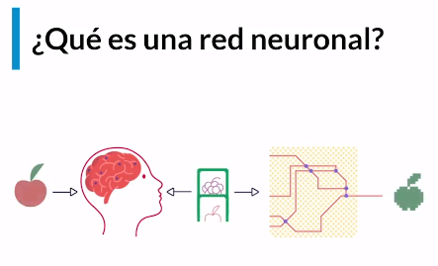

#### Red Neuronal

Una red neuronal consiste en una erie de algoritmos que se esfuerzan por reconocer las relaciones subyacentes en conjunto de datos a traves de un proceso que imita la forma en que opera el cerebro humano.

Una red neuronal biologica: Cuerpo celular,dendritas y los axones

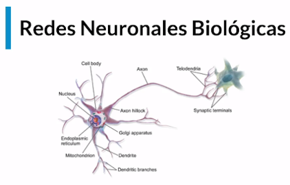

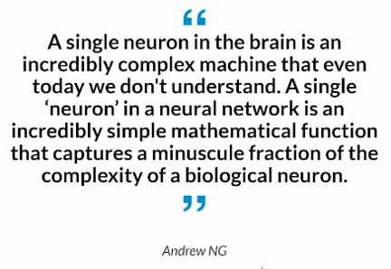

Las neuronas pueden organizarse en capas, y cada una puede tener una especialización, con cada capa desglosamos caracteristicas.

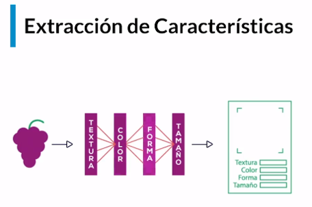

#### Por que usar redes Neuronales

- **Disponibilidad de datos** para entrenar redes.

- **Capacidad computacional** a menor costo y con mayor disponibilidad.

- **Mejores algoritmos** de entrenamiento.

- **Gran comunidad** que constantemente comparte desarrollos, nuevas arquitecturas o nuevas aplicaciones.

- **APIs flexibles, simples y gratuitos**

## Modulo 2 Identificar los principales Frameworks usados en la industria para el desarrollo de Deep Learning

### Clase 2 Frameworks de Deep Learning

Recuerda **Deep Learning** es la denominación que se le da a las redes neuronales con **mas de dos capas**

Frameworks de bajo nivel: Hacen uso de todo el hardware disponible e.g. nvidia cuda y su uso de la gpu, Theano, TensorFlow.

Frameworks de alto nivel se enfocan en la experiencia del usuario e.g Keras, Scikit-learn, fast.ai, h2o.ai

Keras tiene la capacidad de consumir frameworks de bajo nivel

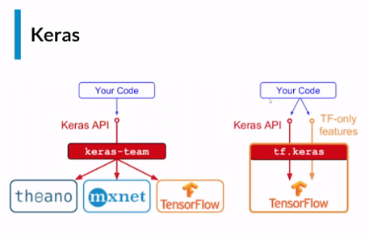

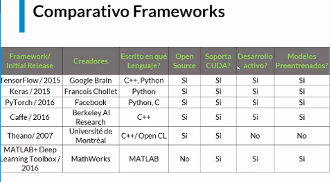

## Modulo 3 Comprender los modelos de representación de las redes neuronales artificiales usados en Deep Learning

### Clase 3 Estructura de redes neuronales

Recordemos que una neurona recibe varios estímulos o señales eléctricas, si estas señales cumplen con determinadas condiciones la neurona envía otras señales eléctricas que se propagan al resto de neuronas  este concepto se aplica al **Perceptron**

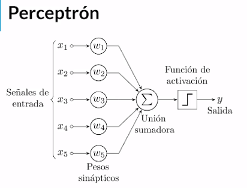

Cada entrada se multiplica por un peso sináptico y pasa a una union sumadora, una vez la union agrupe los resultados pasa estos a una funcion de activación, si el resultado de esa suma supera cierto umbral la función se activa.

**nota:** las redes neuronales solo aceptan valores de tipo numérico.

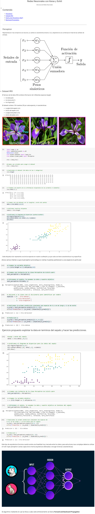

### Clase 4 Creando nuestra primer red neuronal

Vamos a crear nuestra propia arquitectura para tratar de determinar el precio justo de una vivienda en boston de acuerdo a un dataset disponible en keras, tenemos varios datasets disponibles en la documentación.

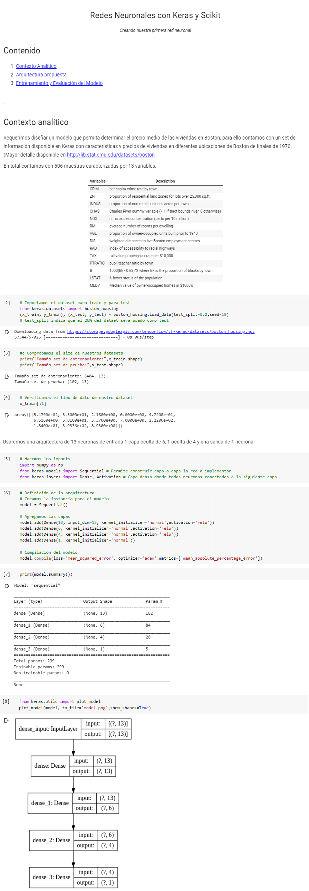

### Clase 5 Entrenando nuestra primera red neuronal

Hasta ahora tenemos dividido el dataset en entrenamiento y prueba, pero tenemos que hacer una division adicional para validación.

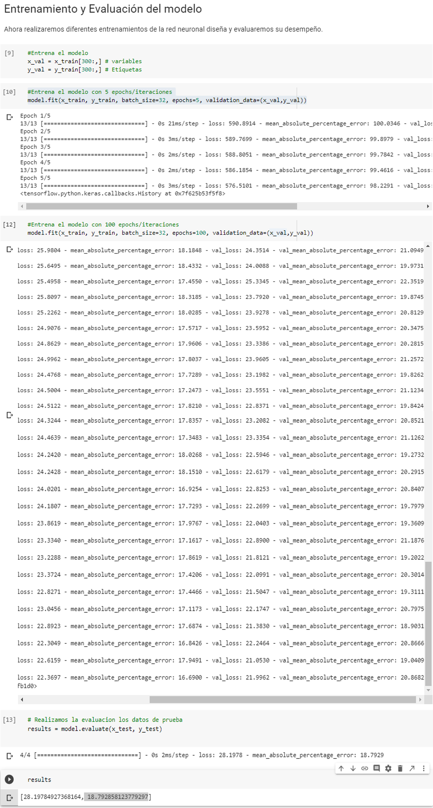

### Clase 6 Visualizando el proceso de entrenamiento

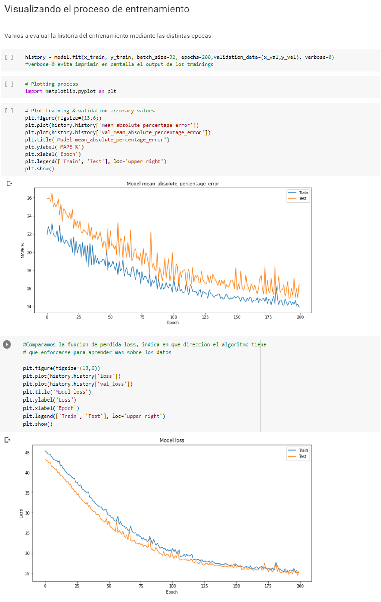

### Clase 7 Funciones de activation

Las neuronas están compuestas por una serie de entradas, unos pesos, una suma ponderada de las entradas con los pesos y una funcion de activaron, a las entradas pueden tomar valores de - infinito hasta +  infinito y  la salida de la neurona existe una activación o un apagado (0,1) o (-1,1).

Computacionalmente las funciones de activación son muy costosas aunado a la cantidad de neuronas y capas que la red pueda tener,por lo que se busca sean sencillas.

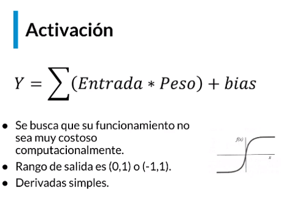

La derivada debe ser simple de calcular porque en los algoritmos de optimizacion utilizan gradientes que empieza a identificar cual es la pendiente a donde deben mover el entrenamiento de la red para aprender mas.

#### Funcion Paso

Si las entradas son menores a cero la respuesta es cero, si los valores son iguales o mayores a cero la respuesta es uno. Esta no permite salidas de multiples valores o clases dada su salida binaria.

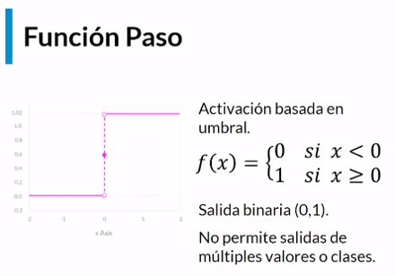

#### Funcion Lineal

Esta si tiene varios valores intermedio, el problema es que ya no esta acotada entre -1 y 1 como la funcion paso, su derivada siempre es una constante, por lo que el afecta al gradiente para detectar en que dirección moverse para poder aprender por lo que la red pierde su capacidad de aprendizaje.

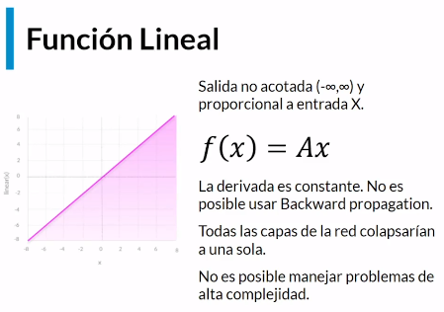

#### Funcion Sigmoid o Logistica

Esta funcion si tiene una salida acotada entre 0 y 1, ademas cuenta con una serie de valores intermedios por lo cual es practica para los problemas de multiples clases, el problema es que es costosa computacionalmente dada su formula.

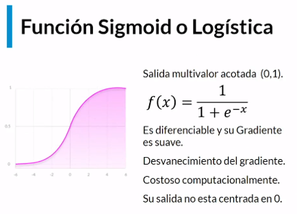

#### Funcion Tangente (Hiperbolica)

Es similar a la funcion anterior pero con derivadas mas pronunciadas que la funcion logistica.

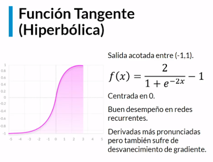

#### Funcion ReLU (Rectified Linear Unit)

Es una de las mas utilizadas, esta definida en dos rangos, para todos los valores menores a cero la respuesta es cero, para todos los valores mayores a cero la respuesta sera el valor de entrada, esta funcion es computacionalmente eficiente (la red aprende/converge rápido),y su derivada solamente da valores positivos

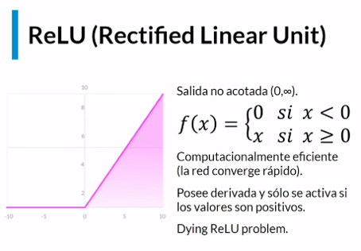

En resumen las funciones de activacion no son mas que una serie de funciones matemáticas que se colocan a la salida de una neurona para poder acotar su respuesta y poder abstraer no linealidades.

### Clase 8 Funciones de costo o perdidas

Los algoritmos de entrenamiento de las redes neuronales necesitan algún tipo de métrica que les indique si los algoritmos están aprendiendo o no, cuando los algoritmos se entrenan se genera un valor predicho, con el set de test podemos verificar la diferencia entre el valor predicho y el valor real, en este punto entra al juego las funciones de costo, algunas estarán enfocadas en la parte numérica y otra en la parte de la clasificación dependiendo de la naturaleza del problema a resolver.

#### Funciones de perdidas en variables numericas

##### Mean Absolute Error (MAE)

El MSE mide la distancia entre los puntos respecto a la recta para todos los puntos muestrales disponibles, luego este valor sera promediado entre la cantidad de muestras, el algoritmo va a intentar minimizar este valor ajustando la recta y su pendiente para reducir esta distancia y error.

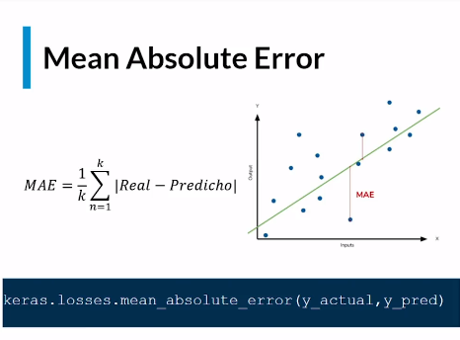

Ventajas

- Describe la magnitud típica de los residuos.
- Es mas robusto frente a los outliers.
- Es sencillo de interpretar (mismas unidades físicas que la funcion de entrada).

##### Mean Squared Error

El error cuadratico medio es similar a la funcion MAE pero eleva al cuadrado las distancias penalizando mas el valor del error. Suele ser la funcion de perdidas por defecto, pero  es sensible (débil) a los outliers.

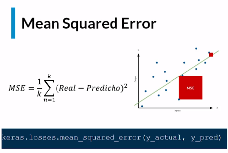

##### Mean Absolute Percentage Error

Utiliza las distancias entre la muestras y la recta pero se escala con el valor real para obtener el valor porcentual, No esta definido cuando los valores sean cero, Penaliza el modelo cuando existen errores grandes, y es robusto frente a los outliers por el uso del valor absoluto.

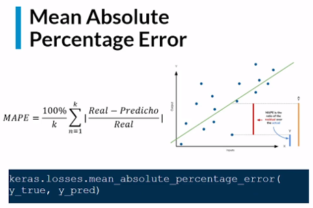

Las tres funciones tienen sus ventajas pero debemos tener cuidado con los datos con los que trabajamos para elegir la mejor funcion.

Comparativa

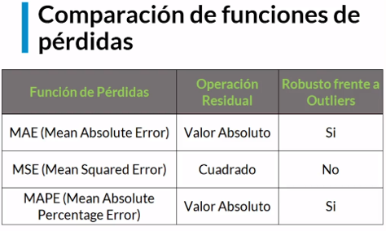

#### Funciones de perdidas en variables categoricas

Para este tipo de problemas las funciones de perdidas deben otorgar un valor de probabilidad a cada una de las clases.

##### Funcion Binary Cross-Entropy

Esta funcion penaliza el modelo cuando existen errores grande y evalúa las dos categorías (0, 1) de una clase.

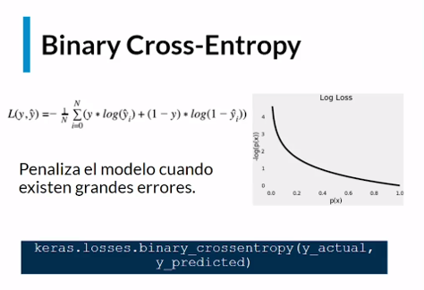

##### Categorical Cross-Entropy

Es utilizada cuando existen multiples clases y asigna un valor de probabilidad determinada por la suma del polinomio logarítmico que otorga a cada clase cuanta probabilidad de predicción tuvo nuestra red neuronal.

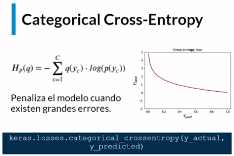

### Clase 9 Inicializacion y Entrenamiento de RN

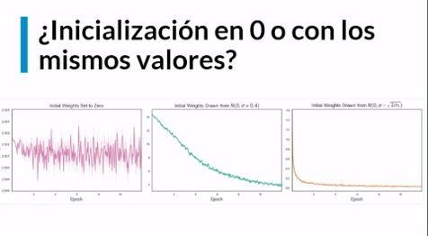

En esta imagen observamos 3 redes neuronales, la primera inicializa sus pesos sinápticos en cero, las otras dos usan una estrategia distinta, observamos como en esas imágenes el loss se acerca cada vez mas a cero, mientras que en la primera la red no esta aprendiendo, asi la taza de aprendizaje puede verse afectada si no hacemos una correcta inicializacion de los pesos sinapticos.

Algunas de las estrategias apuntan a que debemos tener en cuenta los parámetros d entrada y los parámetros de salida.

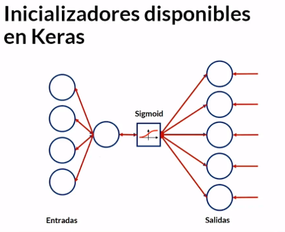

El investigador Xavier Glorot, da su nombre al inicializador de Glorot,  para este método existen dos variaciones la uniforme y la normal.

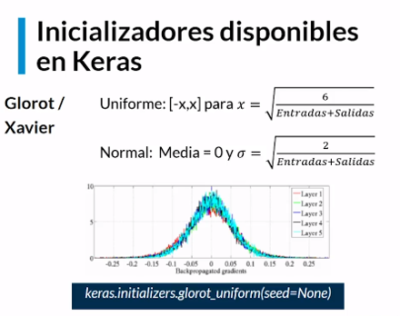

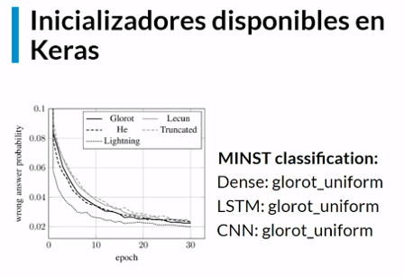

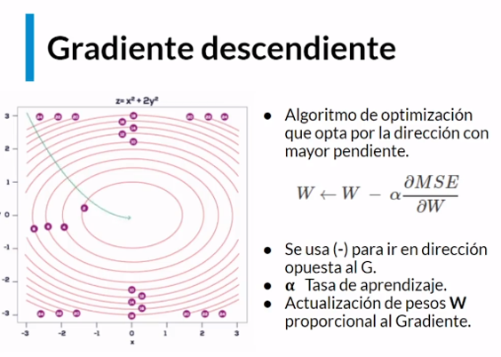

Observamos este algoritmo de la siguiente manera, la primer imagen muestra los pasos a seguir, mientras la de la izquierda la recta que traza el comportamiento del sistema

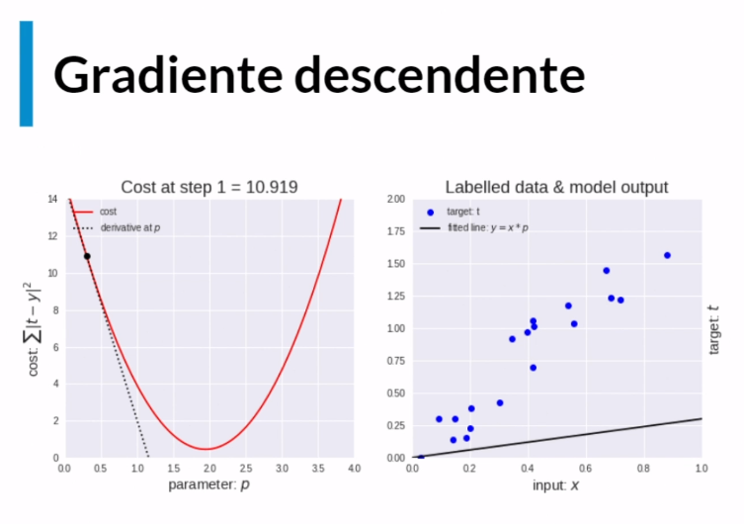

Observamos a medida que la pendiente de nuestra recta en la figura izquierda se acerca a cero, la recta de la figura izquierda para por la mayoría de los puntos.

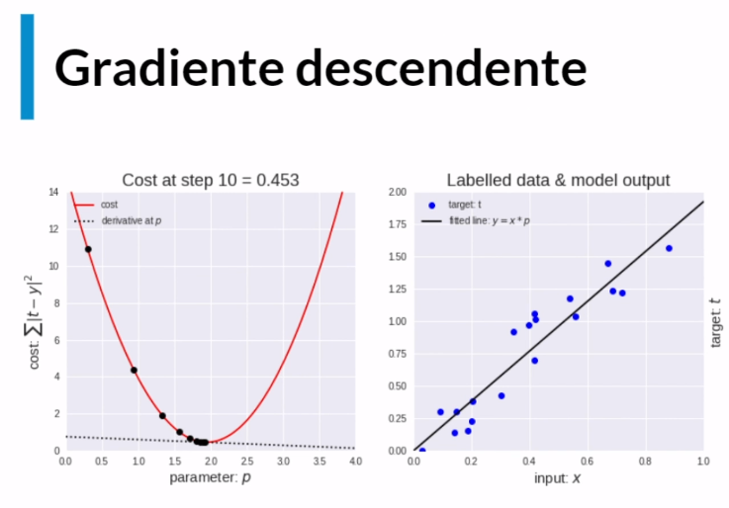

Que problemas tiene este algoritmo?

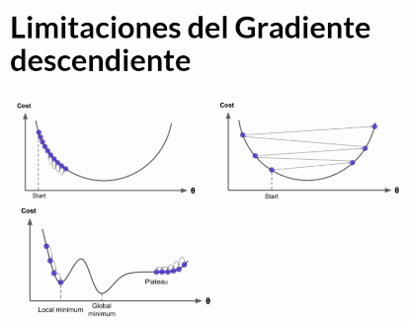

Si la tasa de aprendizaje es muy pequeña el algoritmo puede demorarse mucho y tener un costo computacional alto, si la funcion tiene mínimos locales la funcion puede que no son los mínimos óptimos el algoritmo puede caer en estos y nunca llegar al mínimo global, finalmente si la tasa de aprendizaje es muy grande el algoritmo no va a converger

[Descenso del gradiente por DOTCSV](https://www.youtube.com/watch?v=A6FiCDoz8_4)

### Clase 10 Optimizadores en redes neuronales

El algoritmo del descenso del gradiente funciona muy bien para una serie general de problemas, sin embargo como lo vimos existen una serie de limitaciones que para los distintos tipos de problemas a los que nos enfrentamos como data scientist, afortunadamente existen toda una serie de investigaciones acerca del problema de las funciones no convexas que nos ayudan a resolver estos problemas.

#### Gradiente descendente estocastico

En este algoritmo hacemos la actualización de los pesos sinapticos cada vez que atravesamos un batch (un lote de información)

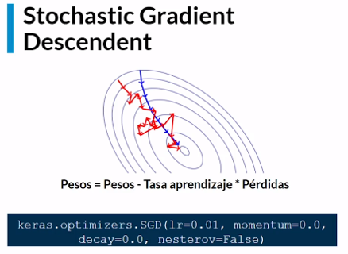

Al actualizar los pesos el entrenamiento llega a ser mas rápido, el trade-off es que el algoritmo puede ser menos preciso.

#### Gradiente Adaptativo (AdaGrad)

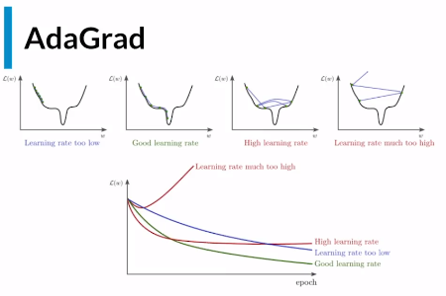

En el la taza de aprendizaje no es constante, y el ajuste de los pesos se hace de manera independiente para alcanzar la solución global

#### Momentum

Imagínalo como un valle en el cual tenemos una pelota en la cima de este, cuando soltemos la pelota en algún momento del tiempo esta pelota tendrá una cierta aceleración e inercia, pero cuando llegue a un mínimo global ya no podrá superar este bache y denotara el mínimo global.

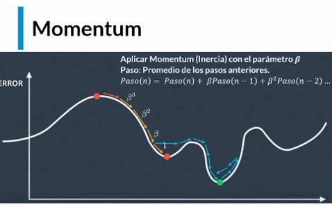

#### ADAM

Este algoritmo es la union de AdaGram y Momentum

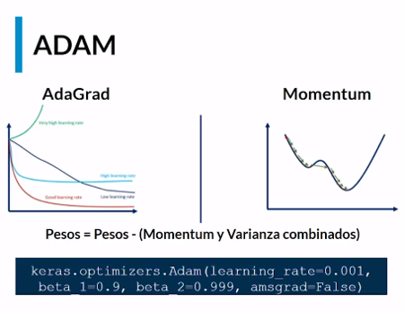

Este hace la combinación entre el momentum y la varianza de la clase, escogemos muchas veces como optimizados por defecto para iniciar nuestra experimentación.

### Clase 11 Clasificación Binaria

Realizamos esta clase en base al rato de clasificación binaria de Kaggle con datos de red hat.

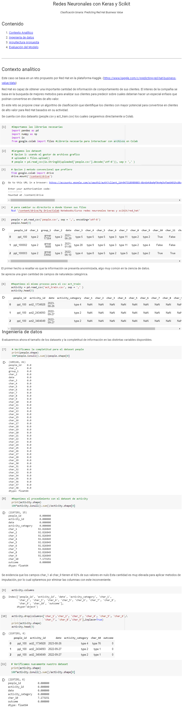

### Clase 12 Clasificación de Potenciales Clientes

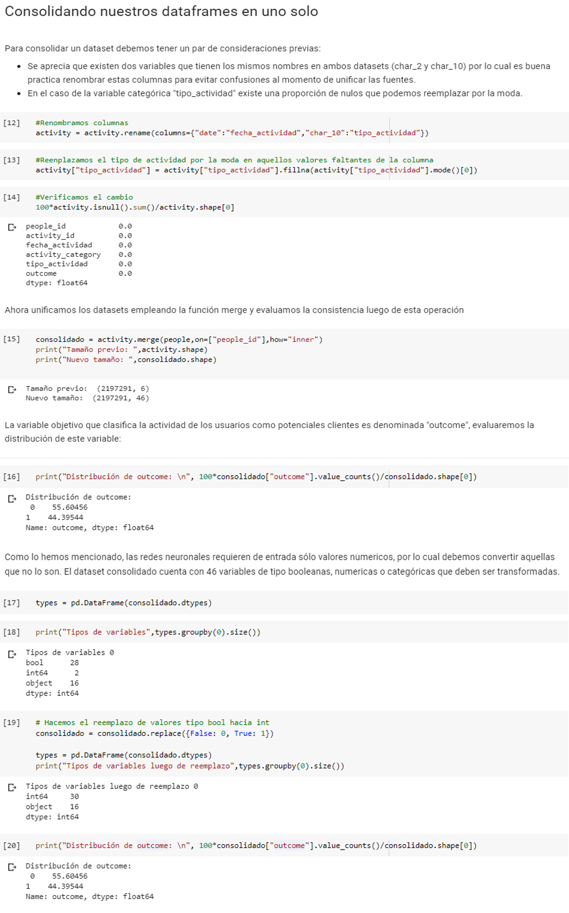

### Clase 13 Analisis de resultados

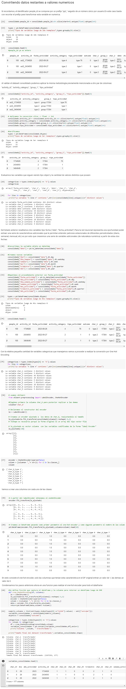

### Clase 14 Metricas de desempeño: regresion y clasificacion

Hasta el momento hemos hablado de dos tipos de problemas, regresión (datos numéricos) y clasificación (datos categóricos)

#### Metricas para regresion

Para los problemas de regresiones podemos utilizar MAE, MSE, MAPE

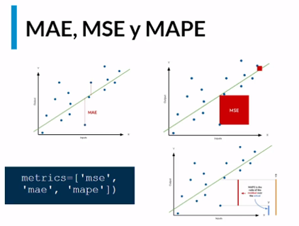

Otra nueva variable desconocida al momento es la  proximidad del coseno.

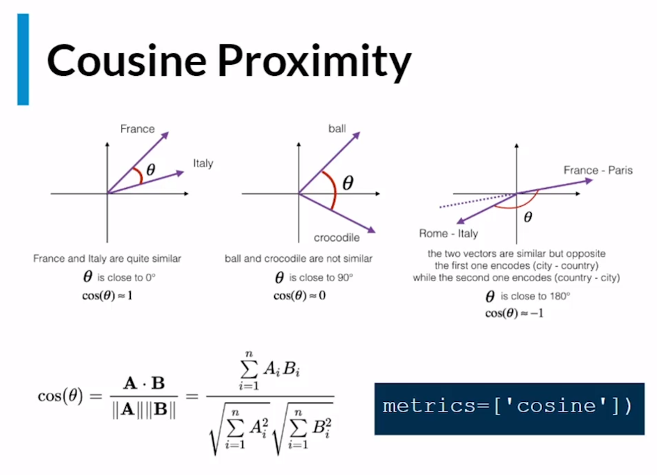

Imagina el siguiente ejemplo, tenemos dos vectores y cada uno hace referencia a un país, en este caso tenemos Francia e Italia, la magnitud del vector no es necesariamente la misma pero lo que **nos  importa es la proximidad o angulo entre ellos**

#### Metricas para clasificacion

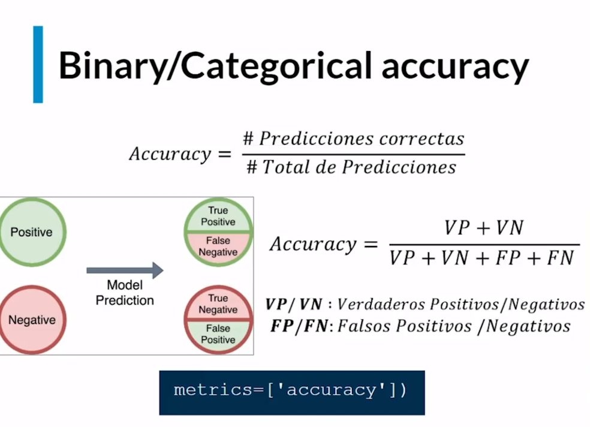

EL **accuracy** o **precision** es la cantidad de predicciones correctas sobre el numero de predicciones totales.

**Ejemplo:** Haremos un test de cancer en 150 pacientes obteniendo el siguiente resultado.

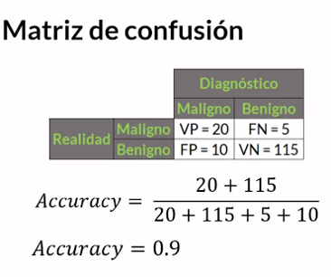

Ahora podemos evaluar otra métrica muy relacionada que podemos evaluar a partir de la matriz de confusion llamada **sensibilidad** o **recall**

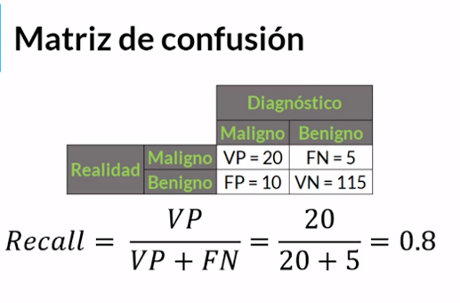

Con los cálculos de **accuracy** y de **recall** podemos  combinarlos para calcular una métrica denominada **F1 score** este no es mas que la media armonica entre las dos metricas y nos  permite encontrar un equilibrio entre la sensibilidad y lo robusto que es modelo para hacer la clasificacion.

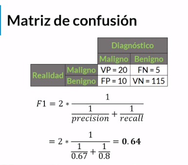

Aquí debemos ser muy críticos, ya que la **sensibilidad** ya nos daba indicios de que no es la mejor prueba para clasificar un tumor como maligno o benigno.

### Clase 15 Evaluando metricas de desempeño

Ahora que tenemos el dataset ya consolidado y todas las variables numericas vamos a empezar separando este set de datos en tres sub-sets (entrenamiento, validación y pruebas) adicionalmente debemos empezar a reflexionar sobre el tipo de problema que tenemos para proponer una arquitectura.

Recordemos que al ser un **clasificador binario** la funcion de perdidas mas adecuada es la **Binary Cross-Entropy**, la funcion de activacion se ajustaría  muy bien a la **Sigmoidal o logistica**, y para  evaluar el desempeño podemos utilizar la **precision o accuracy**

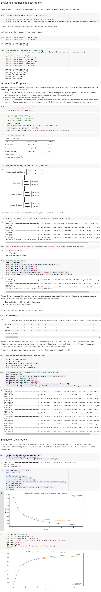

### Clase 16 Ajuste de redes neuronales: overfitting y regularización

En las lecciones anteriores hemos evaluado los principales componentes de las redes neuronales, en esta lección evaluaremos el Overfitting o sobre-ajuste.

Para ejemplificar el Overfitting mira la siguiente imagen y preguntate cual seria el siguiente numero de la secuencia.

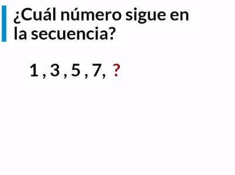

Para mi lo lógico seria pensar que es 9.

Pero para un modelo sobre-entrenado el output seria este

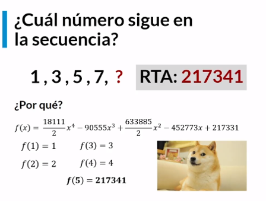

Para el modelo lo mas lógico fue hacer una regresion con un polinomio de cuarto orden para encontrar la respuesta a algo que era tan sencillo lo complico exponencialmente.

Mira las siguientes imágenes, la primera corresponde a una funcion verdadera para nuestra data

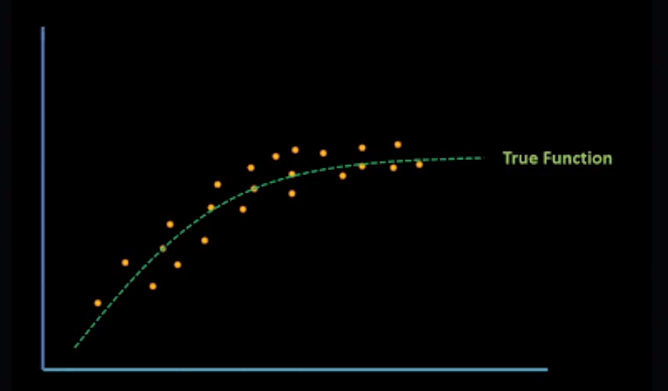

La segunda corresponde a la funcion verdadera vs una funcion polynomial generada por el Overfitting que intenta pasar por cada uno de los puntos de la data

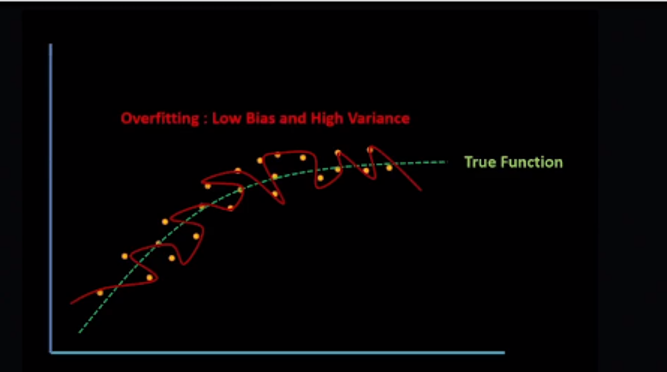

La tercer  imagen corresponde al caso contrario, tenemos una regresion lineal que pasa escasamente por algunos de nuestros puntos de data ocasionando el fenómeno de **underfitting**

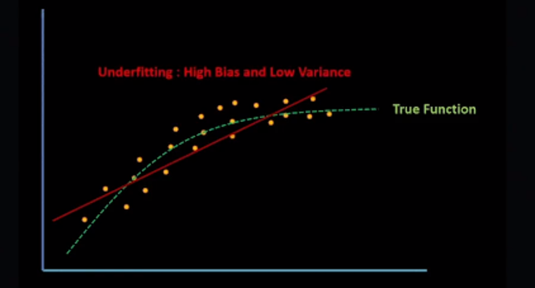

Finalmente tenemos la cuarta imagen donde tenemos un modelo ideal que pasa por la mayoría de los puntos, pero no necesariamente por todos con una trayectoria similar a la funcion original.

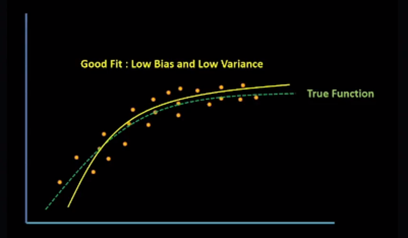

De lo anterior podemos obtener la siguiente  inferencia en forma gráfica

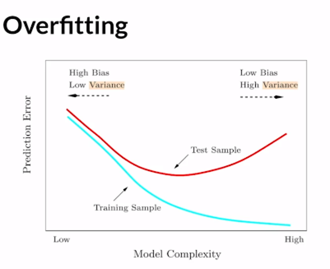

Observamos que el **underfitting** presentará un **Bias alto** y **Varianza baja**, mientras que el **Overfitting** presentara un  **Bias bajo** y **Varianza Alta**, lo ideal para evitar este ultimo comportamiento es detener las épocas en un punto razonable donde tengamos unas metricas aceptables, nunca sera bueno tener un accuracy de 100%, pues el modelo servirá solo para los datos de test y con datos fuera del mismo nos dará resultados inesperados y erróneos.

### Clase 17 Regularizacion

En términos generales la regularizacion es un método que penaliza o disminuye la complejidad de la red neuronal tratando de identificar aquellas variables que no aportan significativamente al fenómeno con el cual estamos trabajando

#### Regularizacion L1 (Lasso)

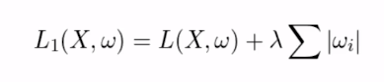

- Penaliza la suma de los valores absolutos de los pesos.
- Genera un modelo mas simple e interpretable.
- Es robusto a los outliers

Con este método tratamos de extraer las caracteristicas que mas importan para el modelo, este método esta **disponible en keras**

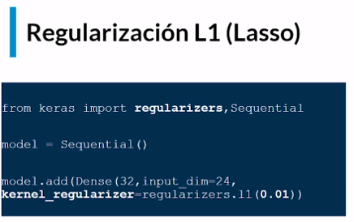

#### Regularizacion L2 (Ridge)

Este método es similar al anterior, salvo que los pesos están elevados al cuadrado.

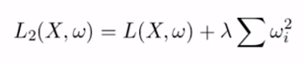

- Penaliza la suma de cuadrados de los valores de los pesos. El parámetro lambda suele ser pequeño.
- Útil para aprender patrones complejos de los datos.
- No es robusto a outliers

Cuando existen muchas variables este método nos permite identificar posibles correlaciones entre variables

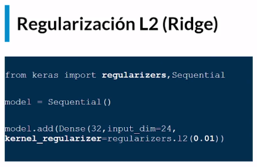

#### Regularizacion ElasticNet

Aprovecha lo mejor de los dos tipos anteriores

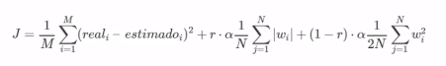

- Útil cuando se dispone de una gran cantidad de parámetros en los que algunos serán irrelevantes y otros estarán interrelacionados.

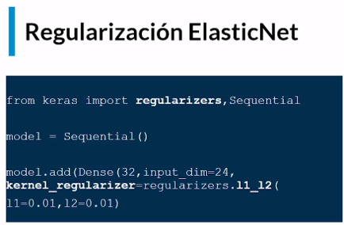

#### Regularizacion Dropout

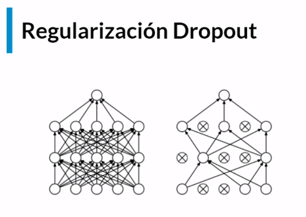

En términos generales con este método con cada iteración apagaremos un numero n de neuronas de forma aleatoria.

Con este método obtenemos dos beneficios:

1.- El entrenamiento es mas rápido porque estamos disminuyendo el numero de parametros que tenemos que configurar

2.- Disminuimos de manera general la dependencia entre neuronas vecinas, reduciendo la probabilidad de overfitting.

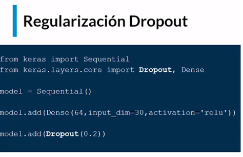

Otros **métodos adicionales** a la clase

**BatchNorm:** Este se considera una innovación clave en el deep learning moderno (2016). Similar a la normalización de los inputs, pero en capas intermedias. Consiste en tomar un batch de datos calcular su media y varianza, actualizar los datos restandolos por su media y dividiendo por su varianza a esto sumarle la constante epsilon, para luego aplicarle una transformación. Más información en este link:
<https://towardsdatascience.com/batch-normalization-and-dropout-in-neural-networks-explained-with-pytorch-47d7a8459bcd>

**Data Augmentation:** Esta técnica es simple pero elegante y se aplica bastante en imágenes, consiste en rotar la imagen o hacerle un zoom e incluir esta matriz en el algoritmo, ya sea el de una red generativa o convolucional. Es la misma imagen pero su matriz de datos no es la misma.

### Clase 18 Ajuste de redes neuronales: Hiper parametros

A lo largo del curso hemos mencionado que en el algoritmo de entrenamiento de la red neuronal se ajustan una serie de parametros, es decir los pesos sinapticos que hacen la multiplicación entre las entradas y la funcion de activación. Adicionalmente existen los hiper parámetros.

hiper parámetros: se refieren a las caracteristicas con las que estamos configurando la arquitectura de la red neuronal, a ciencia cierta no existe un método preciso para ajustar estos hiper parametros, pero a traves de la experiencia el seguir cierta lógica nos permite encontrar soluciones aceptables.

#### Numero de capas y Neuronas por capa

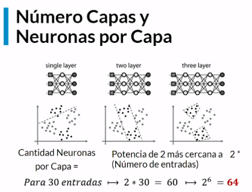

Aumentar la cantidad de capas es necesariamente aumentar la complejidad y el tiempo necesario para el entrenamiento, en contraste nos da la posibilidad de que la red aprenda comportamientos muy complejos

La recomendación es siempre comenzar con una pequeña arquitectura e ir incrementando paulatinamente la cantidad de capas, lo recomendable para el numero de neuronas de entrada máximo es usar la formula de 2^n e ir disminuyendo la cantidad de neuronas en las capas subsecuentes de la misma manera 2^n-1

#### Epocas e Inicializadores

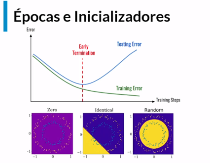

Como lo vemos en la gráfica, a medida que se realizan mas iteraciones en la red pero llega un punto en el cual ambas gráficas empiezan a diverger (este es un indicador de sobreajuste).

Inicializar en cero no siempre es la mejor practica,
la inicialización por defecto glorot uniforme, la mayoría de las redes neuronales funcionan bien.

#### Tasa de Aprendizaje

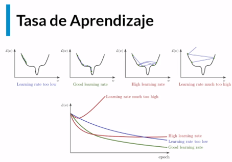

Esto lo vimos mas a detalle al hablar de los optimizadores, de hecho el de ADAM nos libera la carga de especificar puntualmente la tasa de aprendizaje para entrenar nuestra red neuronal.

#### Tamaño de Batch

El tamaño o lote de información con la que vamos a entrenar el modelo

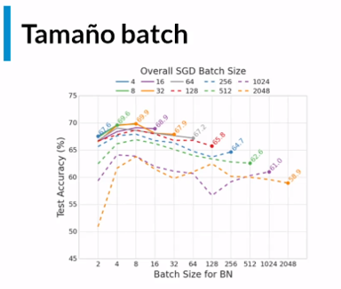

Este tamaño también lo podemos elegir en razón de una potencia de 2

#### Funcion de activacion y perdidas

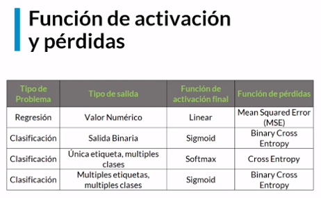

La tabla es una serie de buenas practicas para definir las funciones de activación y de perdidas acorde al tipo de problema a enfrentar.

**Nota importante:** La combinación de todos estos hiper parametros no siguen alguna receta que podamos usar para explotar lo mejor de las redes, existen ciertos métodos en python que nos permite evaluar las multiples combinaciones de los hiper parametros con el fin de encontrar la mejor arquitectura que nos va proveer el mejor desempeño, algunos de ellos son:

Adicional a la clase existen estas herramientas en keras.

En cuanto a keras existen algo conocido como [callbacks](https://keras.io/callbacks/) que son procesos que se aplican dentro del entrenamiento y mejoran estos hiper parametros, en el orden del video que conozca existen:

[EarlyStopping](https://keras.io/callbacks/#earlystopping)
Este detiene el entrenamiento al no ver mejora en una métrica como la pérdida, error, loss, val_loss, entre otras, cuenta con un parámetro paciencia que permite ajustar a las epocas de no ver mejoría en el entrenamiento parara.

[ModelCheckpoint](https://keras.io/callbacks/#modelcheckpoint)
Este callback guarda los pesos y estructura del modelo entrenado por cada época, también se puede configurar para que guarde solo si el modelo ha mejorado en la época actual.

[ReduceLROnPlateau](https://keras.io/callbacks/#reducelronplateau)
Tiene la funcion de monitorear una métrica de mejora configurada por el usuario y cuando no vea mejora reduce la taza de aprendizaje(Learning Rate) lo que le permite frenar el paso cada vez mas y encontrar el mínimo local o global.

[Tensorboard](https://keras.io/callbacks/#tensorboard)
Es un dashboard con toda la información y metricas pertinentes configurada en uno o varios modelos, es un tablero superdinamico que permite comparar modelos y configuraciones.

## Modulo 4 Crear un modelo de regresión a partir de un caso de uso real

### Clase 19 Introducción a las regresiones con Deep Learning: Planteamiento del problema

Reto: El mercado de autos usados es reconocido por ser un sector económico muy competido, cuando tenemos una auto con ciertas caracteristicas determinar el mejor precio al cual lo podemos vender es un reto, la idea es que implementes un método mediante redes neuronales que nos permita pronosticar cual debería ser ese precio justo con el cual podemos vender ese auto usado.

Aqui el [dataset]( https://drive.google.com/drive/u/1/folders/1C9gMArnhfKOXoJFPkVT5rOK6sFnXj9Uo) y el [notebook](https://drive.google.com/drive/u/1/folders/1JsEnifaNjxR1VmzIFo07u5M_9wEdEfnh)

### Clase 20 Solución del problema de regresión

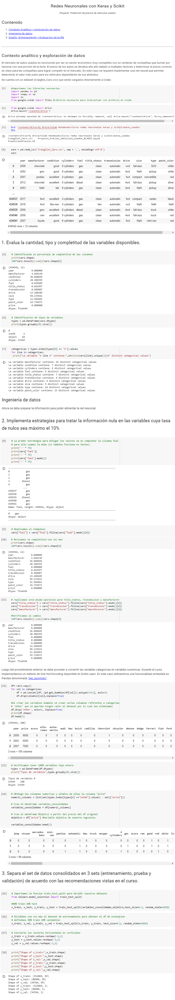

### Clase 21 Ajustes finales al proyecto

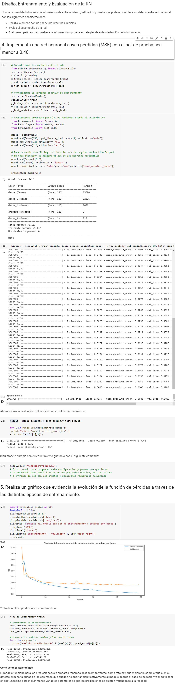
